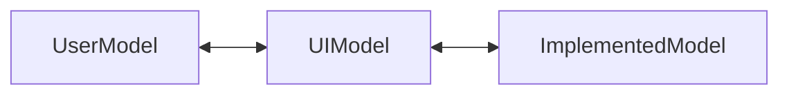
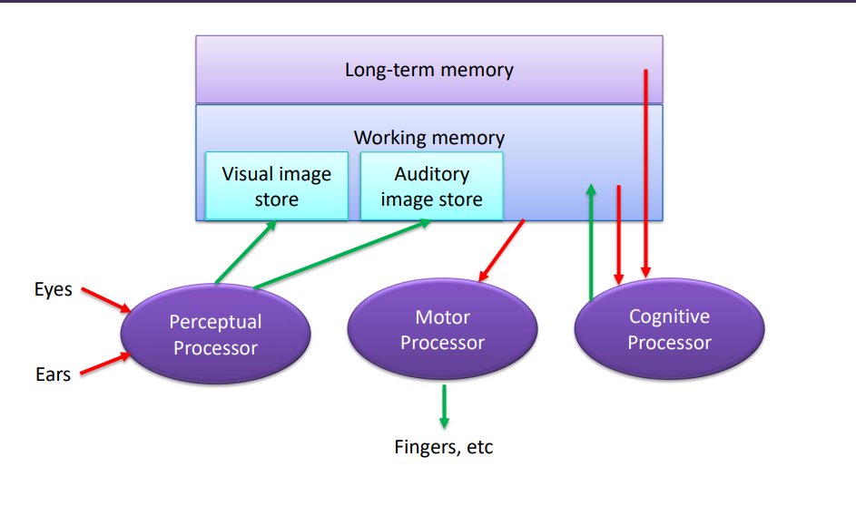

### Mental Model概念模型
- 根据先前的经验，用户的预判，用户想的是什么
- 我们要预判用户的预判
- 因人而异

### Interface Metaphors
- 使用隐喻和类比，使用类似的物理实体
  - 优点
    - 帮助用户更好理解潜在的概念模型
    - 利用已知经验加速熟悉
    - 创新，更进一步发展，多样化的用户使用
  - 缺点
    - 打破传统
    - 束缚思考创新
### Interaction Types
- Type
  - instruction发指令：简单高频操作，快速高效
  - conversation做对话：搜索引擎，siri
  - direct manipulation直接操作：DM伴随着GUI而出现，得益于所见即所得，及时直观地反馈，但效率低
  - exploring漫游：虚拟环境、物理环境
- 混用好
- 区分interaction & interface
  - interaction更加抽象，交互过程的形势，对于用户的
  - interface具体展示，底层物理实现，对机器的
  
### Understanding Users
```puml
physicalSystem --> Goals: EXECUTION BRIDGE(INTENTIONS->ACTION SPECIFICATION->INTERFACE MECHANISM)
Goals --> physicalSystem: EVALUATION BRIDGE(INTERFACE DISPLAY->INTERPRETATION->EVALUATION)
```
- 信息走向、处理的过程 --> 花费精力/时间
```puml
state encoding: 抓主要信息

state comparison: 和在脑子中的搜索对比

state responseSelection: 根据对比结果选择做出什么反馈
state responseExecution: 行动

encoding --> comparison
comparison --> responseSelection
responseSelection --> responseExecution
```
- 三个处理器大头娃娃知识点

- 局限
  - 脑内认知，没有external cognition
  - 单人单机，没有distribution cognition
- 感知和认知
  - 有否思考的过程
  - 感知与生俱来，认知因人而异according to大脑中XXX
### Human Perception
- Gestalt Law
  - 人趋向于把什么样的物体看成一个整体
  - 利用
    - 正向利用：想看成一个整体的遵照
    - 反向利用：不想看成一个整体的不遵照
  - Law of Proximity: 邻近性法则，认为相邻的问题分成一组
  - Law of Similarity: 相似性法则，认为相似的分成一组
  - Law of Continuity: 连续性法则，连续(对齐顺滑)视为一组
  - Law of Closure: 闭合性法则->设计极简，自动补全
  - Law of Symmetry: 对称性法则->[ ][ ][ ]，会override the Law of Proximity
  - Law of Figure-Ground: 一次只能关注前景/背景的其中之一->利用前景抓取注意力
  - Law of Pragnanz: 精炼，怎么简单怎么理解
- Visual Illusion
  - 不可避免inevitable(希望尽量减少)
  - 上下文环境影响
### Cognitive Process
- Movement
  - Fitt's Law
    - $T = a + b\log_{2}{(D / S + 1)}$
    - 描述了进行操作需要的时间T与当前到目标的距离D和目标的大小的关系(操作的难易程度)
    - 设计目标：一般希望又大又近，也需要根据情况具体讨论，也可以正反向利用
    - 例子
      - Mac的菜单栏贴顶==>无限放大了S
      - 鼠标移动到哪个图标就放大哪个
      - 右键出菜单
      - 手机关机在手机上部分操作并且要一定时间
- Memory
  - Sesory Memory
    - 一直都在抓取，需要注意力抓取获得
    - Duration: 1s
    - 不同感官有不同的缓冲
    - 新信息覆盖旧信息
  - Short Term (Working) Memory(STM)
    - like reading
    - Accessed: 70ms
    - Duration: 30s
    - 容量有限，5-9个无序，7个以下有序，但这是再回忆不是交互
  - Long Term Memory(LTM)
    - 存储不仅event，还有经验、模型等等
    - 容量大但又限制
    - Accessed: 100ms
    - type
      - 情景记忆
        - 对事件的记忆
      - 语义记忆
        - 对事实结构化的记录
    - 不断重复rehearsal将STM->LTM
    - Total time hypothesis: 花的时间和学得数量成正比
    - Learning well includes 
    - Learning works best if spread out
    - understanding
      - 对信息建模
      - 结构、熟悉、具象
      - particularly for devices
    - Decay or interference(衰退干扰) 
      - Decay:
        - information degrades
        - 对数增长
      - Interference:
        - New info. overwrites old ones
    - Recall vs. recognition
      - Recall: reproduces from **memory**
      - Recognition: Rresentation of information **cues** us to fact we've seen this before
      - 更喜欢识别
- Reasoning
  - Deductive(推理): 用逻辑从因寻果
  - Inductive(归纳): **Generalizes** from cases we have seen
  - Abductive(回溯，溯因): Reasons about causes from events 由果推因
- Problem Solving
  - Gestalt theory(less is more)
  - Problem space theory(初始-目标，**步步引导**)
  - Using analogy(已知-未知)