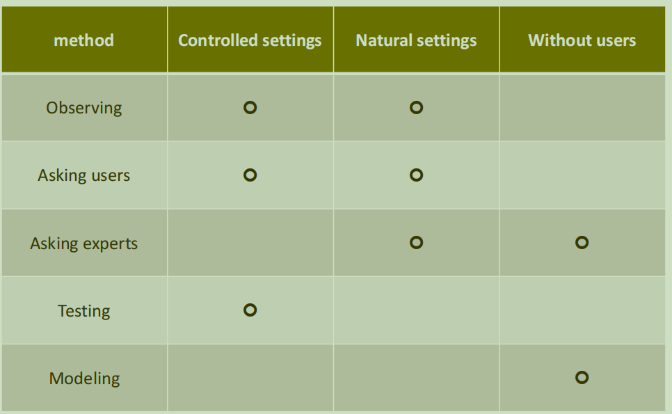

## 低保真度模型
### 故事板
- 动态任务执行
- 交互过程推进
### 卡片
- 屏幕状态的显示
- 静态过程

## 交互系统的评估
### 4W
- Why
    制作过程中有时候会跑偏，因此需要检查用户需求
- What
    完整的原型
#### 展开评估的场合
    用户相关：内测、实测
    评估贯穿整个设计过程
- Where
- When
### 必要性
评估是唯一检测是否有效的方法
### 评估类型
前两者需要用户参与
- Controlled settings 
    实验测试
    软件*内测*
- Natural settings
    实地研究
    软件*公测*
- Any setting
    启发式评估
    直接咨询专家意见
### DECIDE框架
- Determine the **goals**
  - 给谁设计评估，针对不同人群评估的侧重点不同
- Explore the **questions**
    设计问题，考察用户偏好
    但用户没有义务也没有能力告诉我们他们的偏好，我们需要主动设计问题，然后从问题答案中分析出来
    对方不会深层次地思考，也不会分析
- Choose the evaluation **methods**

评估手段和类型的二维矩阵
- Identify the **practical issues**
    考虑实际问题
    - 用户筛选
    - 实验设备
    - 经费
    - ...
- Decide how to deal with **ethical issues**
    道德伦理问题，可能不太尊重测试用户，知情权、自主权(参加了一半也可以退出)、隐私保护等等
- Evaluate, analyse, interpret and present the **data**
    会不会瞎填、无效数据、噪音分析
    - Reliability
        是否能被复制
    - Validity
    - Biases
        偏差，人群的选择全找大学生评估
    - Scope
        能否被推广，推广更大范围评估的结论还能保持
    - Ecological validity
        真实的表现和有人看着你的表现不太一样的
        Hawthon effect
        不可避免，只能尽量减弱

### 物理模型
包括低保真度、高保真度设计

### lab4
- 加入对于角色的设定
- 需求分析
- 功能设计
    - 卡片模型
- 策划与原型界面
- 评估